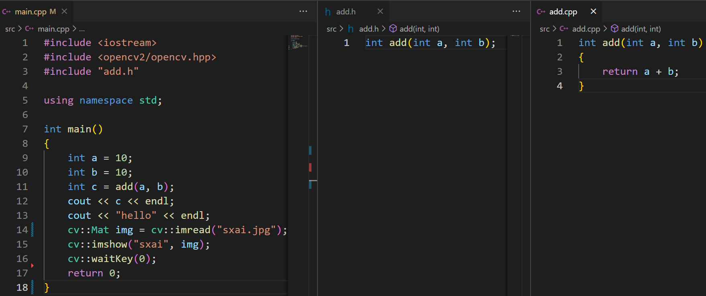

# Makefile tutorial

[toc]

## 一、g++ 指令

1. 预处理：`g++ -E main.cpp -o main.i`
   - 处理#号，如头文件、宏定义、条件编译、注释等，不检查语法错误
2. 编译：`g++ -S main.i -o main.s`
   - 将 C、C++ 语言翻译成汇编指令，会检查语法错误
3. 汇编：`g++ -c main.s -o main.o`
   - 将 汇编指令 翻译成 二进制编码
4. 链接：`g++ main.o -o main.bin`
   - 将函数库中相应的代码组合到目标文件中

#### 1.1	代码结构，main.cpp, add.h, add.cpp


#### 1.2	预处理指令效果

`g++ -S main.i -o main.s`


#### 1.3	编译指令效果

`g++ -S main.i -o main.s` ， `g++ -S add.cpp -o add.s` 


编译过程关心  命名空间、函数名称和参数类型，call调用的**关联**发生在**链接**阶段而不是编译阶段。

下图所示为增加命名空间的结果：


#### 1.4	编译-链接

g++ 允许跳过中间步骤，通常将 预处理-编译-汇编 合成一步统称为**编译**，然后**链接**

**编译-链接** 的指令为

```bash
g++ -c main.cpp -o main.o
g++ -c add.cpp -o add.o
g++ main.o add.o -o out
```


## 二、C++编译时、链接时、运行时

#### 2.1	C++编译链接流程图


#### 2.2	C++编译时

##### 2.2.1	编码和编译的结论

1. C++中的函数、符号、变量会被编码
2. 函数编码关心：函数名称、参数类型、命名空间
3. 函数编码不关心：返回值类型
4. 调用一个函数，会生成 **call 函数名称** 的代码，具体实现不会复制过来

##### 2.2.2	头文件查找方式（编译时）

当程序编译时，`g++ -Ifolder` 表示配置一个头文件查找目录。

**当 `#include “path/name.hpp”` 使用双引号时：**

编译器会在当前文件的目录下查找 `path/name.hpp`，例如我们在 `/data/a.cpp` 中写了 `#include “path/name.hpp”` ，最终确认的路径是 `/data/path/name.hpp` 

**当 `#include <path/name.hpp>` 使用尖括号时：** 

- 第一顺序：以 `g++ -I` 配置的路径查找，例如 `g++ -I/data/folder`，确认路径是：`/data/folder/path/name.hpp`，对所有路径都进行测试，找到为止
- 第二顺序：g++内置的系统路径，一般是 `/usr/include` … 等等，`g++ -print-search-dirs` 可以打印出来
- 第三顺序：系统环境变量配置的路径，例如： `C_INCLUDE_PATH` ,  `CPP_INCLUDE_PATH` 

#### 2.3	C++ 链接时

##### 2.3.1	链接过程

任何链接的符号（例如add），会在**所有链接的对象**中查找实现，例如在b.o、lib3rd.so、libpkg.a中找，如果没找到，则会报 undefined reference 的错误，如果找到多个，则 multiple definition 。**任何符号的实现全局只能有一个。** 

如果链接的符号在so中，out会引用这个符号的so文件，在运行时动态加载lib3rd.so后，再调用add函数。

如果链接的符号在a中，out会将add的实现代码完整复制到out中，运行out时，不需要libpkg.a。

##### 2.3.2	so/a文件查找方式（链接时）

**当程序链接时**，如何决定链接的是哪个so、a文件呢，是按照如下依据来的：

`g++ -lname`，表示链接一个动态库或者静态库（.so / .a），名字是libname.so/libname.a

`g++ -Lfolder`，表示配置一个动态/静态库的查找目录

g++查找so/a文件的地方有3个，按照下列优先顺序查找：

- 第一顺序：-L配置的目录
- 第二顺序：g++内置的系统目录，例如 `/usr/lib`… 等等
- 第三顺序：系统环境变量（例如 `LIBRARY_PATH` ）指定的目录

#### 2.4	C++ 运行时 so文件、a文件查找方式（运行时）

**当程序运行时**，此时进入运行时状态，跟编译链接完全不同。此时的so文件的查找则也不同，是按照如下进行：

- 第一顺序：应用程序的当前目录（当前目录不同于程序所在目录）
- 第二顺序：out中储存的rpath（run path）。`readelf -d out` 指令可以查看文件的runpath信息。如果该选项指定了依旧失效，说明依赖的so文件还存在更多依赖在其他目录没有明确（常用）
- 第三顺序：环境变量指定的目录（例如 `LD_LIBRARY_PATH` ）

#### 2.5	案例——OpenCV读图显示

##### 2.5.1	代码结构



##### 2.5.2	编译

```bash
g++ -c main.cpp -o main.o -I/usr/local/include
# -I/usr/local/include 指定opencv头文件路径
g++ -c add.cpp -o add.o
```

##### 2.5.3	链接

```bash
g++ main.o add.o -o out -lopencv_core -lopencv_imgcodecs -lopencv_highgui -L/usr/local/lib
# -L/usr/local/lib 指定opencv库路径
```


## 三、分析程序依赖项，readelf、ldd

`readelf -d out` 可以查看程序依赖的so文件，以及 `run path` 路径。

`lld out` 可以查看该程序依赖的so文件，查找到的具体路径。


## 四、Makefile 基础

Makefile解决的问题是：**描述生成依赖关系**，根据生成和依赖文件修**改时间的新旧**决定是否执行command。

#### 4.1	makefile 基本语法：

1. 数据类型，字符串和字符串数组

2. 定义变量，`var := folder`，定义变量var，为string类型，值是folder

3. 定义数组，`var := hello world folder`，定义变量var，为数组类型，值是[“hello”, “world”, “folder”]

4. 定义的方式有多种

   ```makefile
   # 1. = 基本赋值，Makefile全部执行后决定取值(不常用)
   var = folder 
   # 2. := 基本赋值，当前所在位置决定取值(常用)
   var := folder 
   # 3. ?= 如果没有赋值，则赋值为folder
   var ?= folder 
   # 4. += 添加值，在var后面添加值。可以认为数组后边增加元素，中间有空格
   var += folder
   ```

5. `$(var)`，`${var}`，取var的值，小括号大括号均可以

6.  `$(func param)`，调用Make提供的内置函数

   例如：`var := $(shell echo hello)`，定义var的值为执行 `shell echo hello` 后的输出

   例如：`$(info $(var))`，直接打印var变量内容

   例如：`var := $(subst a,x,aabbcc)`，替换aabbcc中的a为x后赋值给var，结果xxbbcc

7. 逻辑语法: `ifeq`、`ifneq`、`ifdef`、`ifndef`

   ```makefile
   ifeq($(var), depends)
   	name := hello
   endif
   ```

8. command是shell指令，可以使用`$(var)`来将变量用到其中。前面加`@`表示执行执行时不打印原指令内容。否则默认打印指令后再执行指令

9. make不写具体生成名称，则会选择依赖关系中的第一项生成

#### 4.2	定义依赖关系

Makefile主要解决的问题是，**描述生成依赖关系**，根据生成和依赖文件修改时间新旧决定是否**执行command**。


```makefile
# 生成 main.o 依赖 main.cpp
# 若 main.cpp 的修改时间比 main.o 新
# 则触发执行 shell 指令 g++ -c main.cpp -o main.o
main.o : main.cpp
	g++ -c main.cpp -o main.o

# 生成项可以没有依赖项，那么如果该生成项文件不存在，command将永远执行。
debug : 
	@echo $(info debug)
```

#### 4.3	案例1——简单程序Makefile构建


```makefile
# Makefile文件：
main.o : main.cpp
	@echo 编译main.cpp
	g++ -c main.cpp -o main.o
add.o : add.cpp
	@echo 编译add.cpp
	g++ -c add.cpp -o add.o
out : main.o add.o
	@echo 链接生成out
	g++ main.o add.o -o out
```

#### 4.4	Makefile标准结构


一个标准工程，我们做如下定义：

- 具有src目录，存放我们的代码，可能有多级，例如main.cpp，add/add.cpp等
- 具有workspace目录，存放我们编译后的可执行程序、资源、数据
- 具有objs目录，存放由cpp编译后得到的o文件等中间文件
- Makefile文件，当前工程的Makefile代码

##### 优化Makefile：

```makefile
# 解决cpp文件的多级目录查找问题
# 使用shell指令find检索src文件夹下的后缀为.cpp的文件
srcs := $(shell find src -name "*.cpp")
# 将.cpp的后缀替换为.o
objs := $(srcs:.cpp=.o)
# 将src/前缀替换为objs/前缀，让.o文件存放到objs目录下
objs := $(objs:src/%=objs/%)

# 定义通配依赖关系，%相当于变量部分
# $@：左边的生成项
# $<：右边依赖项的第一个
objs/%.o : src/%.cpp
	@echo 编译$<，生成$@，目录是：$(dir $@)
	mkdir -p $(dir $@)
	g++ -c $< -o $@

# $^：右边的全部依赖项
# 把可执行程序pro放到workspace下
workspace/pro : $(objs)
	@echo 链接$@
	g++ $^ -o $@

# 简化指令，make pro 即可生成程序
pro : workspace/pro
	@echo 编译完成

# 定义make run，编译好pro后直接执行
run : pro
	@cd workspace && ./pro

# 定义make clean，清理编译文件
clean : 
	@rm -rf workspace/pro objs

# 定义伪符号，这些符号视作指令，不视作文件
.PHONY : pro run clean
```

#### 4.3	案例2——调用第三方库的Makefile构建

还是以最简单的调用opencv读图显示为例：


相比之前的例子，要增加头文件、库文件的搜索路径，链接库名称，并在编译和链接时添加到指令后。

```makefile
# 解决cpp文件的多级目录查找问题
# 使用shell指令find检索src文件夹下的后缀为.cpp的文件
srcs := $(shell find src -name "*.cpp")
# 将.cpp的后缀替换为.o
objs := $(srcs:.cpp=.o)
# 将src/前缀替换为objs/前缀，让.o文件存放到objs目录下
objs := $(objs:src/%=objs/%)

# 头文件路径，库文件路径，链接库名称
include_paths := /usr/local/include 
library_paths := /usr/local/lib 
ld_librarys   := opencv_core opencv_imgcodecs opencv_highgui

# 增加run_paths变量，语法是：g++ main.o test.o -o out.bin -Wl,-rpath=/xx/xx/lib
# runpath路径是运行时的so查找路径，通过runpath避免运行时找不到so，也避免把so复制到workspace目录下
run_paths     := $(library_paths:%=-Wl,-rpath=%)

# 把每一个头文件路径前面增加-I，库文件路径前面增加-L，链接选项前面加-l
include_paths := $(include_paths:%=-I%)
library_paths := $(library_paths:%=-L%)
ld_librarys   := $(ld_librarys:%=-l%)

# 编译和链接选项
compile_flags := -std=c++14 -w -g -O0 $(include_paths)
link_flags := $(library_paths) $(ld_librarys) $(run_paths)

# 定义通配依赖关系，%相当于变量部分
# $@：左边的生成项
# $<：右边依赖项的第一个
objs/%.o : src/%.cpp
	@echo 编译$<，生成$@，目录是：$(dir $@)
	mkdir -p $(dir $@)
	g++ -c $< -o $@ $(compile_flags)

# $^：右边的全部依赖项
# 把可执行程序pro放到workspace下
workspace/pro : $(objs)
	@echo 链接$@
	g++ $^ -o $@ $(link_flags)

# 简化指令，make pro 即可生成程序
pro : workspace/pro
	@echo 编译完成

# 定义make run，编译好pro后直接执行
run : pro
	@cd workspace && ./pro

# 定义make clean，清理编译文件
clean : 
	@rm -rf workspace/pro objs

# 定义伪符号，这些符号视作指令，不视作文件
.PHONY : pro run clean
```

至此一个简单通用的Makefile模板已经写好了。


## 五、完整通用Makefile

头文件修改cpp自动编译的处理方法

**`g++ -MM test.cpp -MF test.mk -MT prefix/test.o`** 

该指令产生 **test.mk** 文件，里面写了 test.cpp 依赖的头文件。test.mk 本身就是 makefile 语法，他解析了 test.cpp 的全部头文件后分析
所有依赖的头文件，并写成makefile语法。

`-MM`  分析  `#include “test.hpp”`，引号类型的包含
`-M`    分析全部包含，尖括号和引号
`-MF`  指定储存路径
`-MT`  指定依赖项名称

为了使 **test.mk** 生效，我们可以通过 `include test.mk` 包含进来。

以下为完整的通用Makefile模板：

```makefile
# 检索src目录查找.cpp后缀文件，用shell指令find
srcs := $(shell find src -name "*.cpp")
# 将srcs的后缀.cpp替换为.o
objs := $(srcs:.cpp=.o)
# 将src/前缀换成objs/前缀，让.o文件到objs目录下
objs := $(objs:src/%=objs/%)
# 将.o后缀换成.mk，让依赖文件.mk也在objs目录下
mks  := $(objs:.o=.mk)

# 增加 include_paths变量，头文件路径
include_paths := lean/curl7.78.0/include \
				 lean/openssl-1.1.1j/include
# 增加library_paths变量，库文件路径
library_paths := lean/curl7.78.0/lib     \
				 lean/openssl-1.1.1j/lib
# 增加链接选项
ld_librarys   := curl ssl crypto

# 把library path给拼接为一个字符串，例如a b c => a:b:c
# 然后使得LD_LIBRARY_PATH=a:b:c
empty := 
library_path_export := $(subst $(empty) $(empty),:,$(library_paths))

# 增加run_paths变量，语法是：g++ main.o test.o -o out -Wl,-rpath=/xx/xx/lib
# runpath路径是运行时的so查找路径，通过runpath避免运行时找不到so，也避免把so复制到workspace目录下
run_paths     := $(library_paths:%=-Wl,-rpath=%)

# 使用$(var:src=dst)语法，将dst的值赋给src，将路径前面加上特定符号，变为g++的指令需要
# -I是配置头文件路径，-L是配置库路径，-lname配置依赖的so或a
# 把每一个头文件路径前面增加-I，库文件路径前面增加-L，链接选项前面加-l
include_paths := $(include_paths:%=-I%)
library_paths := $(library_paths:%=-L%)
ld_librarys   := $(ld_librarys:%=-l%)

# 编译选项，使用C++11标准，-w避免警告，-g生成调试信息，-O0优化级别关闭，头文件路径
compile_flags := -std=c++11 -w -g -O0 $(include_paths)
# 链接选项
link_flags := $(library_paths) $(ld_librarys) $(run_paths)

debug :
	@echo include_paths: $(include_paths)
	@echo library_paths: $(library_paths)
	@echo ld_librarys: $(ld_librarys)
	@echo run_paths: $(run_paths)
	@echo link_flags: $(link_flags)

# 所有的头文件依赖产生的makefile文件，进行include
# -include表示如果有异常请不要打印出来
# 这里判断，如果是clean指令，则不需要生成包含mk文件
ifneq ($(MAKECMDGOALS), clean)
-include $(mks)
endif

objs/%.o : src/%.cpp
	@echo 编译$<，生成$@，目录是：$(dir $@)
	@mkdir -p $(dir $@)
	@g++ -c $< -o $@ $(compile_flags)	# 把编译选项加到g++编译后面

workspace/pro : $(objs)
	@echo 链接$@
	@g++ $^ -o $@ $(link_flags)			# 把链接选项加到g++链接后面

objs/%.mk : src/%.cpp
	@echo 生成依赖$@
	@mkdir -p $(dir $@)
	@g++ -MM $< -MF $@ -MT $(@:.mk=.o) $(compile_flags)

pro : workspace/pro
	@echo 编译完成

run : pro
	@cd workspace && ./pro

clean :
	@rm -rf workspace/pro objs

# 添加.PHONY，让作为指令存在的东西，不要被视作为文件
.PHONY : pro run debug clean

export LD_LIBRARY_PATH:=$(LD_LIBRARY_PATH):$(library_path_export)
```

参考： [github](https://github.com/shouxieai/makefile_tutorial_project.git)   [知乎](https://zhuanlan.zhihu.com/p/396448133) 


## 附：环境变量 LIBRARY_PATH 和 LD_LIBRARY_PATH的区别

PATH是可执行文件的环境变量。

LIBRARY_PATH 和 LD_LIBRARY_PATH 是Linux下的两个环境变量，二者的含义和作用分别如下：

两者的共同点是库，库是这两个路径和PATH路径的区别；

LIBRARY_PATH环境变量用于在***程序编译链接期间***查找动态链接库时指定查找共享库的路径；

例如，指定gcc编译需要用到的动态链接库的目录。设置方法如下（其中，LIBDIR1和LIBDIR2为两个库目录）：

```bash
export LIBRARY_PATH=LIBDIR1:LIBDIR2:$LIBRARY_PATH
```

LD_LIBRARY_PATH环境变量用于在***程序加载运行期间***查找动态链接库时指定除了系统默认路径之外的其他路径；

注意，LD_LIBRARY_PATH中指定的路径会在系统默认路径之前进行查找。

设置方法如下（其中，LIBDIR1和LIBDIR2为两个库目录）：

```bash
export LD_LIBRARY_PATH=LIBDIR1:LIBDIR2:$LD_LIBRARY_PATH
```

**区别与使用：**

开发时，设置LIBRARY_PATH，以便gcc能够找到编译时需要的动态链接库。

发布时，设置LD_LIBRARY_PATH，以便程序加载运行时能够自动找到需要的动态链接库。


