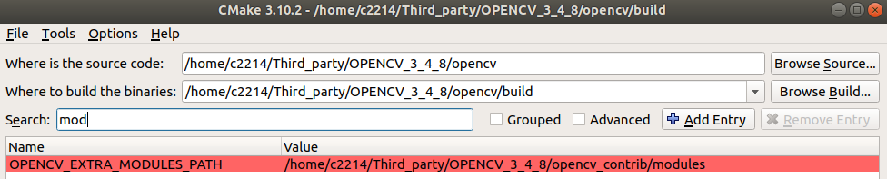
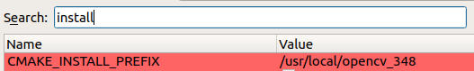
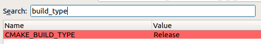
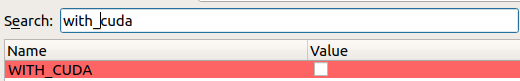

# Ubuntu Install & Config Tutorials 

[toc]


## 一、系统安装与重装

#### 1	系统分区

**注意：** 留一部分空间 (200GB~300GB) 不要分区，用于后续挂载作数据存储、备份

- EFI        500MB    主分区     用于EFI系统分区
- /            50GB       主分区  		

- home   尽量多     主分区  

#### 2	挂载空余分区

1. 在disk应用中找到刚才留下的空白分区，点击创建，例如名字为 `data` 

2. 编辑 `/etc/fstab` 文件，使其能够开机自动挂载

   ```bash
   sudo gedit /etc/fstab
   # 参考home分区，添加下面两句：
   # /media/lsf/data was on /dev/nvme1n1p3 during installation
   UUID=446a1545-b9d3-4317-8798-bb5e5d738f2b  /media/lsf/data   ext4   defaults    0    2
   ```

   其中UUID，挂载路径/media/lsf/data 等需要根据自己修改，UUID可在disk应用中找到，挂载路径一般为/media/username/data

#### 3	data分区作用

1. 存放数据集、文件备份
2. 存放不轻易移动、占用空间较大的软件（例如OpenCV，CUDA，Docker，Anaconda，Texlive等），既是存放也同时是备份，既可以省去根目录很多空间，又可以在重装系统后不需要重新安装

#### 4	系统重装

1. 重装系统时在 something else 之后选择分区时，只把 `EFI`、`/` 分区删除，保留 `home` 和 `data`，正常安装系统。

2. 安装成功后 `home` 目录是系统默认在 `/` 分区中分配的，编辑 `/etc/fstab` 文件，挂载之前的 `home` 和 `data` 

   ```bash
   sudo gedit /etc/fstab
   # 添加：
   # /home was on /dev/nvme0n1p7 during installation
   UUID=63635483-82cc-43a4-ba50-4e72b765ded4 /home           ext4    defaults     0     2
   # /media/lsf/data was on /dev/nvme1n1p3 during installation
   UUID=446a1545-b9d3-4317-8798-bb5e5d738f2b  /media/lsf/data   ext4   defaults    0    2
   ```

   其中的UUID和路径根据自己修改

3. 此时之前在 `home` 中的代码、文件、应用等都会保留，安装在 `data` 中的软件也会保留，只需要安装 `apt` 源中的一些软件即可。


## 二、Ubuntu source

使用阿里云，在/etc/apt/sources.list

```sh
# ubuntu20.04
deb http://mirrors.aliyun.com/ubuntu/ focal main restricted universe multiverse
deb http://mirrors.aliyun.com/ubuntu/ focal-security main restricted universe multiverse
deb http://mirrors.aliyun.com/ubuntu/ focal-updates main restricted universe multiverse
deb http://mirrors.aliyun.com/ubuntu/ focal-backports main restricted universe multiverse
```

- Ubuntu 22.04：jammy
- Ubuntu 20.04：focal
- Ubuntu 18.04：bionic


## 三、ROS install

#### 1  官方安装步骤

1.1  Setup your sources.list

```bash
sudo sh -c 'echo "deb http://packages.ros.org/ros/ubuntu $(lsb_release -sc) main" > /etc/apt/sources.list.d/ros-latest.list'
```

1.2  Set up your keys

```bash
sudo apt install curl # if you haven't already installed curl
curl -s https://raw.githubusercontent.com/ros/rosdistro/master/ros.asc | sudo apt-key add -
```

1.3  Installation

```bash
sudo apt update
sudo apt install ros-noetic-desktop-full
echo "source /opt/ros/noetic/setup.bash" >> ~/.bashrc
```

1.4  Initialize rosdep

```bash
sudo apt install python3-rosdep python3-rosinstall python3-rosinstall-generator python3-wstool build-essential
sudo apt install python3-rosdep
sudo rosdep init
rosdep update
```


## 四、PX4 install

#### 1	克隆px4仓库，编译

```bash
mkdir PX4
cd PX4
git clone https://github.com/PX4/Firmware.git
cd Firmware
git checkout v1.12.2
git submodule update --init --recursive
# 一直执行最后一句，只到没有任何响应，确保把子模块全部克隆完成
```

#### 2	安装依赖与编译

```bash
bash ./Tools/setup/ubuntu.sh --no-nuttx
make px4_sitl_default gazebo
# 解决sitl文件缺失问题，可能一遍通过不了，多编译几遍，最好翻墙。
# 编译完成会打开gazebo，终端输入 commander takeoff 测试无人机起飞。
```

如果gazebo *报错 [Err] [REST.cc:205] Error in REST request* 解决

```bash
gedit ~/.ignition/fuel/config.yaml
将  url: https://api.ignitionfuel.org
改为  url: https://api.ignitionrobotics.org
```

#### 3	mavros and mavlink

apt仓库安装

```bash
sudo apt-get install ros-melodic-mavros ros-melodic-mavros-extras
# 完成后依次执行：
wget https://raw.githubusercontent.com/mavlink/mavros/master/mavros/scripts/install_geographiclib_datasets.sh
sudo chmod +x install_geographiclib_datasets.sh
sudo ./install_geographiclib_datasets.sh
# 最后一步安装geographiclib_datasets需要很长时间，耐心等待
```


## 五、CUDA / cuDNN / TensorRT install

#### 1	nvidia-driver

```bash
# 1.如果有旧驱动，把旧驱动卸载
sudo apt remove --purge nvidia*
sudo apt remove --purge libnvidia*
# 2.更新
sudo apt update
# 3.查看驱动
sudo ubuntu-drivers devices | grep nvidia-driver
# 4.安装
sudo apt install nvidia-driver-525
# 5.重启
reboot
```

#### 2	CUDA

2.1  从[官网](https://developer.nvidia.com/cuda-toolkit-archive)下载 .run 文件

2.2  安装

```bash
# 建议选择cuda10.2(低算力)或cuda11.8(高算力)
sudo sh cuda_10.2.89_440.33.01_linux.run
sudo sh cuda_11.8.0_520.61.05_linux.run
# cuda安装包是自带显卡驱动的，按空格去掉安装显卡驱动的选项，然后选择install
```

2.3  配置环境变量

```bash
gedit ~/.bashrc
export PATH=/usr/local/cuda/bin${PATH:+:${PATH}}
export LD_LIBRARY_PATH=/usr/local/cuda/lib64${LD_LIBRARY_PATH:+:${LD_LIBRARY_PATH}}
```

(附)2.4	CUDA移动与多版本切换

2.4.1  删除原来的软链接

```bash
cd /usr/local
sudo unlink cuda
```

2.4.2  移动CUDA到data盘

```bash
sudo mv /usr/local/cuda-11.8 /media/lsf/data/cuda-11.8
```

2.4.3  建立新的软链接

```bash
sudo ln -snf /media/lsf/data/cuda-11.8 /usr/local/cuda
```

2.4.4  多版本切换

​		安装多个版本之后，都可移动到data盘，然后需要用哪个版本就创建哪个版本的软链接

#### 3  cuDNN

3.1  从[官网](https://developer.nvidia.com/cudnn)下载相应版本的cudnn

3.2  复制这些文件到CUDA的目录下

```bash
sudo cp cuda/include/cudnn*.h /usr/local/cuda/include 
sudo cp -P cuda/lib64/libcudnn* /usr/local/cuda/lib64
sudo chmod a+r /usr/local/cuda/include/cudnn*.h /usr/local/cuda/lib64/libcudnn*
```

#### 4  TensorRT

4.1  从[官网](https://developer.nvidia.com/nvidia-tensorrt-download)下载相应版本的TensorRT，建议下载tar压缩包，方便使用，解压之后开箱即用

4.2  环境变量

```bash
export LD_LIBRARY_PATH=$LD_LIBRARY_PATH:/home/lsf/Third_party/TensorRT/TensorRT-8.2.4.2/lib
# 当然也可以放到data盘
export LD_LIBRARY_PATH=$LD_LIBRARY_PATH:/media/lsf/data/TensorRT/TensorRT-8.2.4.2/lib
```

4.3  Python pkg

```bash
cd TensorRT-${version}/python
python3 -m pip install tensorrt-*-cp3x-none-linux_x86_64.whl
cd TensorRT-${version}/graphsurgeon
python3 -m pip install graphsurgeon-0.4.6-py2.py3-none-any.whl
cd TensorRT-${version}/onnx_graphsurgeon
python3 -m pip install onnx_graphsurgeon-0.3.12-py2.py3-none-any.whl

# Install the Python UFF wheel file. This is only required if you plan to use TensorRT with TensorFlow.
cd TensorRT-${version}/uff
python3 -m pip install uff-0.6.9-py2.py3-none-any.whl
# Check the installation with:
which convert-to-uff
```


## 六、OpenCV install

#### 1	安装依赖

```shell
[compiler] sudo apt-get install build-essential
[required] sudo apt-get install cmake git libgtk2.0-dev pkg-config libavcodec-dev libavformat-dev libswscale-dev
[optional] sudo apt-get install python-dev python-numpy libtbb2 libtbb-dev libjpeg-dev libpng-dev libtiff-dev libdc1394-22-dev
```

#### 2	命令行编译安装

```shell
# 默认安装不需CUDA，安装路径为/usr/local
mkdir build && cd build
cmake -D CMAKE_BUILD_TYPE=Release -D CMAKE_INSTALL_PREFIX=/usr/local -D OPENCV_EXTRA_MODULES_PATH=~/Third_party/OPENCV_3_4_8/opencv_contrib/modules .. 
make -j16
sudo make install
```

#### 3	使用 **cmake-gui** 生成 makefile 编译安装

​	通过图形界面配置编译选项，可以指定安装目录，CUDA等









​	**注意：**opencv3.x版本不支持Ampere架构显卡(cuda11.x)，需要opencv4.x版本

#### 4	配置环境变量

```shell
export PKG_CONFIG_PATH=/your/path/to/lib/pkgconfig:$PKG_CONFIG_PATH
export LD_LIBRARY_PATH=/your/path/to/lib:$LD_LIBRARY_PATH
```

#### 5	编译cv_bridge

```shell
git clone https://github.com/ros-perception/vision_opencv.git
git checkout noetic
catkin_make
source ~/vision_opencv/devel/setup.bash
```


## 七、Conda install and config

#### 1	Anaconda

1.1	从[官网](https://www.anaconda.com/)下载 .sh 文件

1.2	安装

```shell
bash Anaconda3-2021.11-Linux-x86_64.sh
```

​	默认安装路径为~/anaconda3，中间可以输入自定义安装路径 /media/lsf/data/anaconda3

​	环境变量

```shell
# >>> conda initialize >>>
# !! Contents within this block are managed by 'conda init' !!
__conda_setup="$('/media/lsf/data/anaconda3/bin/conda' 'shell.bash' 'hook' 2> /dev/null)"
if [ $? -eq 0 ]; then
    eval "$__conda_setup"
else
    if [ -f "/media/lsf/data/anaconda3/etc/profile.d/conda.sh" ]; then
        . "/media/lsf/data/anaconda3/etc/profile.d/conda.sh"
    else
        export PATH="/media/lsf/data/anaconda3/bin:$PATH"
    fi
fi
unset __conda_setup
# <<< conda initialize <<<
```

1.3	conda换源

```shell
conda config --add channels https://mirrors.ustc.edu.cn/anaconda/pkgs/main/
conda config --add channels https://mirrors.ustc.edu.cn/anaconda/pkgs/free/
conda config --add channels https://mirrors.ustc.edu.cn/anaconda/cloud/conda-forge/
conda config --add channels https://mirrors.ustc.edu.cn/anaconda/cloud/msys2/
conda config --add channels https://mirrors.ustc.edu.cn/anaconda/cloud/bioconda/
conda config --add channels https://mirrors.ustc.edu.cn/anaconda/cloud/menpo/

conda config --set show_channel_urls true
# 第三方pytorch源
conda config --add channels https://mirrors.ustc.edu.cn/anaconda/cloud/pytorch/
```

1.4	.condarc

​	conda源的配置在***~/.condarc***文件中，当源出现问题时来此文件中修改配置。

```shell
show_channel_urls: true
auto_activate_base: false

channels:
  - defaults
```

#### 2	miniconda

- anaconda包含了conda、python等180多个科学包及其依赖项，体格比较大。但很多东西你未必用到，所以才有mini版。
- miniconda是最小的conda安装环境，只有conda+python+pip+zlib和一些其他常用的包，体格非常迷你。

安装：从[官网](https://docs.conda.io/en/latest/miniconda.html)下载自己需要的版本


## 八、Docker

#### 1	安装

```bash
# 根据自己的网络情况选择其中一种方式安装
# 1.官方网站安装
curl https://get.docker.com | sh 
# 2.官方网站并使用阿里云加速
curl -fsSL https://get.docker.com | bash -s docker --mirror Aliyun
# 3.国内 daocloud 一键安装命令
curl -sSL https://get.daocloud.io/docker | sh
```

配置阿里云镜像加速 https://cr.console.aliyun.com/cn-hangzhou/instances/mirrors

#### 2	移动docker

因为docker镜像特别占用`/`目录空间，所以可以将其移动到 `data` 盘中，节省空间且方便重装系统。

```bash
sudo mv /var/lib/docker /media/lsf/data/docker
# 创建软链接
sudo ln -snf /media/lsf/data/docker /var/lib/docker
```


## 九、Texlive

参考[清华源文档](https://mirrors.tuna.tsinghua.edu.cn/CTAN/info/install-latex-guide-zh-cn/install-latex-guide-zh-cn.pdf) 

#### 1	下载iso文件

 [清华源](https://mirrors.ctan.org/systems/texlive/Images/texlive2022.iso) 

#### 2	检查镜像是否正确

```bash
md5sum texlive2022.iso
# 若显示如下则正确
dadcf7ea5224f174ec2abcea6923a42 texlive2022.iso
```

#### 3	挂载镜像并安装

```bash
sudo mkdir /mnt/texlive
sudo mount ./texlive2022.iso /mnt/texlive
sudo /mnt/texlive/install-tl
# 安装完成后可以弹出镜像并删除
sudo umount /mnt/texlive
sudo rm -r /mnt/texlive
```

#### 4	设置环境变量

```bash
gedit ~/.bashrc
export PATH=/usr/local/texlive/2022/bin/x86_64-linux:$PATH
export MANPATH=/usr/local/texlive/2022/texmf-dist/doc/man:$MANPATH
export INFOPATH=/usr/local/texlive/2022/texmf-dist/doc/info:$INFOPATH
```

#### 5	处理字体

```bash
# 将配置文件复制到系统
sudo cp /usr/local/texlive/2022/texmf-var/fonts/conf/texlive-fontconfig.conf /etc/fonts/conf.d/09-texlive.conf
# 刷新字体缓存
sudo fc-cache -fsv
# 如果fc-cache无法执行：
sudo apt install fontconfig
```

#### 6	移动texlive

因为texlive镜像特别占用`/`目录空间，所以可以将其移动到 `data` 盘中，节省空间且方便重装系统。

选择移动并创建软链接而不是直接在安装时选择自定义目录的原因是：在默认目录/usr/local中的话，后续配置vscode、texstudio等会方便很多，没有自定义的特殊路径。

```bash
sudo mv /usr/local/texlive /media/lsf/data/texlive
# 创建软链接
sudo ln -snf /media/lsf/data/texlive /usr/local/texlive
```


## 十、NumCpp——Cpp中的numpy

[github](https://github.com/dpilger26/NumCpp.git) ，像Python中numpy一样非常好用的矩阵计算库！

#### 1	安装boost

在 [官网](https://boostorg.jfrog.io/artifactory/main/release/1.68.0/source/) 下载对应版本的boost压缩包，解压

```bash
./bootstrap.sh
./b2
sudo ./b2 install
```

#### 2	安装NumCpp

```bash
git clone https://github.com/dpilger26/NumCpp.git
cd NumCpp
mkdir build && cd build
cmake ..
sudo cmake --build . --target install
```


## 十一、TVM源码编译安装

#### 1	源码

```bash
git clone --recursive https://github.com/apache/tvm tvm
git submodule update
```

#### 2	安装依赖

TVM 库的最低构建要求是：

- 支持 C++17 的最新 C++ 编译器

  - GCC 7.1
  - Clang 5.0
  - Apple Clang 9.3
  - Visual Stuio 2019 (v16.7)

- CMake 3.18 或更高版本

- 推荐使用 LLVM 构建 TVM 库以启用所有功能。

- 安装LLVM：

  ```bash
  wget https://github.com/llvm/llvm-project/releases/download/llvmorg-13.0.0/clang+llvm-13.0.0-x86_64-linux-gnu-ubuntu-20.04.tar.xz
  echo 'export LLVM_HOME=/home/lsf/Third_party/clang+llvm-13.0.0/bin' >> ~/.bashrc
  echo 'export PATH=$LLVM_HOME:$PATH' >> ~/.bashrc
  ```

- 如需使用 CUDA，请确保 CUDA 工具包的版本至少在 8.0 以上。注意：CUDA 旧版本升级后，请删除旧版本并重新启动。

- Python：推荐使用 3.7.X+ 和 3.8.X+ 版本，3.9.X+ 暂时[不支持](https://github.com/apache/tvm/issues/8577)。

```bash
sudo apt-get update
sudo apt-get install -y python3 python3-dev python3-setuptools libtinfo-dev zlib1g-dev build-essential libedit-dev libxml2-dev
# 解决找不到OpenCL和ld等错误
sudo apt install -y libssl-dev ocl-icd-opencl-dev lld libboost-all-dev 
```

#### 3	使用CMake来构建

创建一个构建目录，将 `cmake/config.cmake` 复制到该目录。

```bash
mkdir build
cp cmake/config.cmake build
```

编辑 `build/config.cmake` 自定义编译选项：

- 将 `set(USE_CUDA OFF)` 改为 `set(USE_CUDA ON)` 以启用 CUDA 后端。对其他你想构建的后端和库（OpenCL，RCOM，METAL，VULKAN......）做同样的处理。

- 为了便于调试，请确保使用 `set(USE_GRAPH_EXECUTOR ON)` 和 `set(USE_PROFILER ON)` 启用嵌入式图形执行器（embedded graph executor）和调试功能。

- 如需用 IR 调试，可以设置 `set(USE_RELAY_DEBUG ON)`，同时设置环境变量 *TVM_LOG_DEBUG*。

  > ```bash
  > export TVM_LOG_DEBUG="ir/transform.cc=1;relay/ir/transform.cc=1"
  > ```

- TVM 需要 LLVM 用于 CPU 代码生成工具（Codegen）。推荐使用 LLVM 构建。

  - 使用 LLVM 构建时需要 LLVM 4.0 或更高版本。注意，默认的 apt 中的 LLVM 版本可能低于 4.0。

  - 由于 LLVM 从源码构建需要很长时间，推荐从 [LLVM下载页面](https://releases.llvm.org/download.html) 下载预构建版本。

    解压缩到某个特定位置，修改 `build/config.cmake` 以添加 `set(USE_LLVM /path/to/your/llvm/bin/llvm-config)`

  - PyTorch 的用户建议设置 `set(USE_LLVM "/path/to/llvm-config --link-static")` 和 `set(HIDE_PRIVATE_SYMBOLS ON)` 以避免 TVM 和 PyTorch 使用的不同版本的 LLVM 之间潜在的符号冲突。

#### 4	编译

```bash
cd build
cmake ..
make -j12
```

#### 5	Python包安装

bashrc中添加

```bash
export TVM_HOME=/path/to/tvm
export PYTHONPATH=$TVM_HOME/python:${PYTHONPATH}
```

安装Python依赖。

注意，如果想要安装到一个受管理的本地环境，如 `virtualenv`，则不需要 `--user` 标志。

```bash
# 必要的依赖
pip3 install --user numpy decorator attrs
# 使用 RPC 跟踪器
pip3 install --user tornado
# 使用 auto-tuning 模块
pip3 install --user tornado psutil xgboost cloudpickle
```

#### 6	测试

C++测试：

可以用 [Google Test](https://github.com/google/googletest) 来驱动 TVM 中的 C++ 测试。安装 GTest 最简单的方法是从源代码安装：

```bash
git clone https://github.com/google/googletest
cd googletest
mkdir build
cd build
cmake -DBUILD_SHARED_LIBS=ON ..
make
sudo make install
```

安装成功后，进入tvm目录：

```bash
make cpptest
./tests/scripts/task_cpp_unittest.sh
```

Python测试：

```python
import tvm
print(tvm.__version__)
```


## 十二、禁用内核和系统软件更新

#### 1  禁用内核更新

查看正在使用的内核

```bash
uname -a
```

禁用内核更新

```bash
sudo apt-mark hold linux-image-5.15.0-57-generic
sudo apt-mark hold linux-headers-5.15.0-57-generic
sudo apt-mark hold linux-modules-extra-5.15.0-57-generic
```

查看锁定结果

```bash
sudo apt-mark showhold
```

#### 2  禁用软件更新

```bash
sudo gedit /etc/apt/apt.conf.d/10periodic
# 把后面的值全部改为0
APT::Periodic::Update-Package-Lists "0";
APT::Periodic::Download-Upgradeable-Packages "0";
APT::Periodic::AutocleanInterval "0";
APT::Periodic::Unattended-Upgrade "0";

sudo gedit /etc/apt/apt.conf.d/20auto-upgrades
# 把后面的值全部改为0
APT::Periodic::Update-Package-Lists "0";
APT::Periodic::Download-Upgradeable-Packages "0";
APT::Periodic::AutocleanInterval "0";
APT::Periodic::Unattended-Upgrade "0";
```


## 十三、一些软件、应用的安装

#### 1  sysmonitor

```bash
sudo add-apt-repository ppa:fossfreedom/indicator-sysmonitor
sudo apt-get update
sudo apt-get install indicator-sysmonitor
indicator-sysmonitor
```

#### 2  sublime text

```bash
# 安装GPG
wget -qO - https://download.sublimetext.com/sublimehq-pub.gpg | sudo apt-key add -
# 确保apt被设置为https源
sudo apt-get install apt-transport-https
# 选择稳定版本
echo "deb https://download.sublimetext.com/ apt/stable/" | sudo tee /etc/apt/sources.list.d/sublime-text.list
# 安装sublime-text
sudo apt-get update
sudo apt-get install sublime-text
# 或者直接在Ubuntu应用商店中搜索安装sublime text
```

#### 3  typora

在[中文官网](https://typoraio.cn/releases/all)中下载测试版0.11.18下载，1.x版本之后收费。

#### 4  zsh

```bash
# 1.安装zsh
sudo apt install zsh
# 2.安装oh my zsh
wget https://raw.githubusercontent.com/ohmyzsh/ohmyzsh/master/tools/install.sh
bash install.sh
# 3.切换系统shell为zsh
cat /etc/shells  # 查看系统安装的所有shell
sudo chsh -s /bin/zsh  # 切换为zsh
# 4.常用插件
cd ~/.oh-my-zsh/plugins
git clone https://github.com/zsh-users/zsh-syntax-highlighting.git
git clone https://github.com/zsh-users/zsh-autosuggestions.git
git clone https://github.com/zsh-users/zsh-completions.git
sudo apt install autojump
# 在.zshrc中添加插件
plugins=(git extract zsh-syntax-highlighting zsh-autosuggestions zsh-completions autojump)
# 5.主题
ZSH_THEME="ys"
```

#### 5	Openvino

参考官网安装教程 [Get Started Guides](https://docs.openvino.ai/latest/openvino_docs_install_guides_installing_openvino_apt.html#doxid-openvino-docs-install-guides-installing-openvino-apt)

```bash
wget https://apt.repos.intel.com/intel-gpg-keys/GPG-PUB-KEY-INTEL-SW-PRODUCTS.PUB
sudo apt-key add GPG-PUB-KEY-INTEL-SW-PRODUCTS.PUB
echo "deb https://apt.repos.intel.com/openvino/2022 bionic main" | sudo tee /etc/apt/sources.list.d/intel-openvino-2022.list
sudo apt update
apt-cache search openvino
sudo apt install openvino
```

Run this command in shell. (Every time before using OpenVINO)

```bash
source /opt/intel/openvino_2022/setupvars.sh
```

安装python(3.8)依赖

```bash
cd /opt/intel/openvino_2022/tools
pip install -r requirements[onnx].txt
```

#### 6	坚果云

 [官网教程](https://www.jianguoyun.com/s/downloads/linux) 

#### 7	cmake升级

```bash
# 下载cmake源码包
wget https://github.com/Kitware/CMake/releases/download/v3.21.4/cmake-3.21.4-linux-x86_64.tar.gz
tar -xzvf cmake-3.21.4-Linux-x86_64.tar.gz

# 将解压出来的包移到 /opt 目录下
sudo mv cmake-3.21.4-Linux-x86_64 /opt/cmake-3.21.4  

# 建立软链接
sudo ln -sf /opt/cmake-3.21.4/bin/* /usr/bin/   

cmake --version
```

#### 8	LLVM+Clang

```bash
wget https://github.com/llvm/llvm-project/releases/download/llvmorg-13.0.0/clang+llvm-13.0.0-x86_64-linux-gnu-ubuntu-20.04.tar.xz
echo 'export LLVM_HOME=/home/lsf/Third_party/clang+llvm-13.0.0/bin' >> ~/.bashrc
echo 'export PATH=$LLVM_HOME:$PATH' >> ~/.bashrc
```

